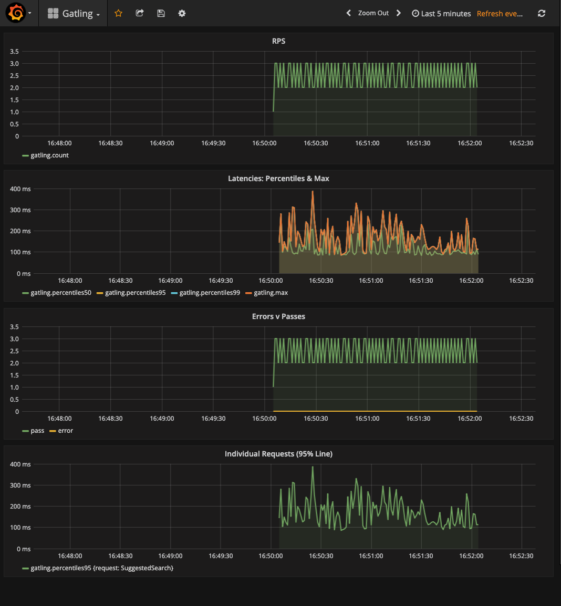

# Gatling Real-time Monitoring

Gatling can provide live metrics via the Graphite protocol which can be persisted and visualised.
This project shows how to use InfluxDB, Graphite, and Grafana to monitor Gatling tests in real-time.

Use `docker-compose up` to launch Grafana and Influx DB infrastructure. Go to [localhost:3000](http://localhost:3000) to see Grafana dashboard.

Configure your Gatling instance to use graphite protocol to send data to InfluxDB. Update following config in data section of your gatling.conf file:
```
data {
  writers = [console, file, graphite]      # The list of DataWriters to which Gatling write simulation data (currently supported : console, file, graphite, jdbc)
  .....
  graphite {
      light = false              # only send the all* stats
      host = "localhost"         # The host where the Carbon server is located
      port = 2003                # The port to which the Carbon server listens to (2003 is default for plaintext, 2004 is default for pickle)
      protocol = "tcp"           # The protocol used to send data to Carbon (currently supported : "tcp", "udp")
      #rootPathPrefix = "gatling" # The common prefix of all metrics sent to Graphite
      bufferSize = 8192          # Internal data buffer size, in bytes
      writePeriod = 1            # Write period, in seconds
    }
  .....
}
```
Fore more details see Gatling docs [here.](https://gatling.io/docs/current/realtime_monitoring/?highlight=graphite)


You can see a sample Grafana dashboard below.

<p align="left">

</p>